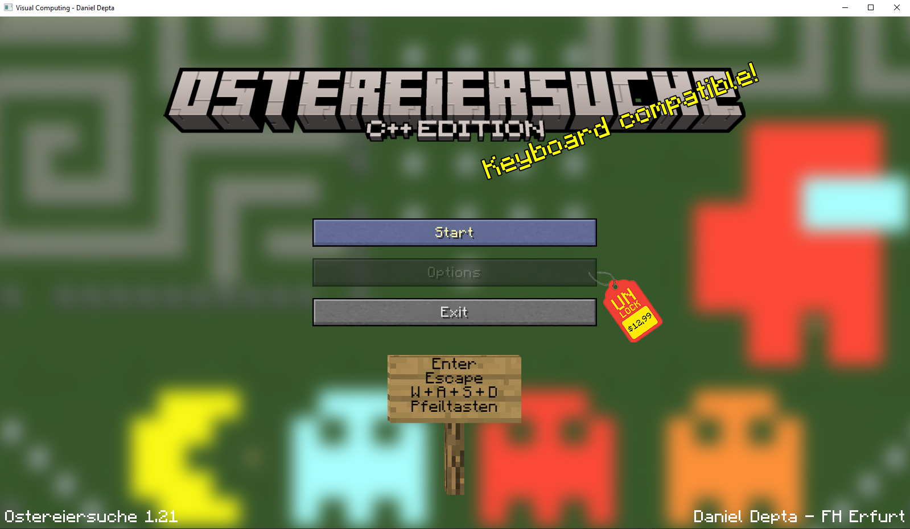
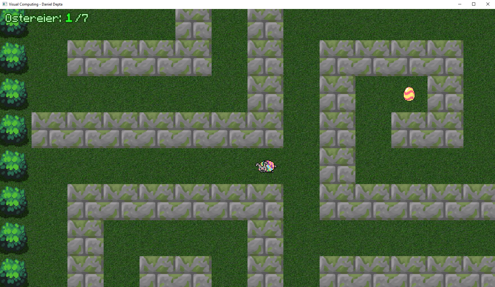
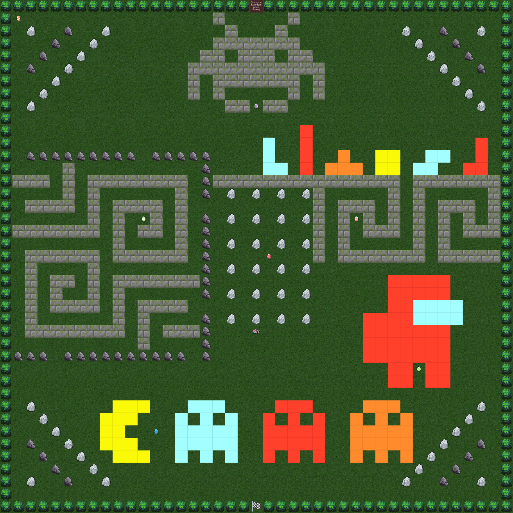

# VC2023

C++-Spiel mit SFML für das Modul Visual Computing an der FH Erfurt.

## Beschreibung

Im Spiel steuert man eine animierte Spielfigur und man muss Ostereier einsammeln.
Über die Zielflagge gelangt man wieder zurück ins Hauptmenü.
Es gibt einige Eastereggs!

### Steuerung

Das Spiel kann über Pfeiltasten oder WASD gesteuert werden.

| Taste      | Befehl                         |
| ---------- | ------------------------------ |
| W / hoch   | nach oben                      |
| A / links  | nach links                     |
| S / runter | nach unten                     |
| D / rechts | nach rechts                    |
| ESC        | zurück zum Hauptmenü / beenden |
| Enter      | Hauptmenü-Auswahl bestätigen   |

### Features

- Animierter Spielcharakter (GIF, wird nur bei Bewegung abgespielt)
- auswählbare Buttons im Menü
- dynamische Score-Berechnung
- Darstellung mit SFML
- XML-System für Entitys und Meta-Entitys
  - Level-System per XML
- Event/Eventlistener-System
- Zustandsautomat (Phasen)

### Screenshots

Startmenü

Ingame

Map

